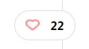
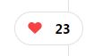

# Blife "Prueba Técnica"

## Roberto Martínez García

El proyecto fue recrear el Frontend proporcionado por Blife ["link del proyecto"](https://www.figma.com/file/IuLObxCwhPnP1h5vSIkXvH/Examen-Blife-Frontend?type=design&node-id=0-1&mode=design&t=Q4NrhQFh6rrrDiQp-0), las tecnologías con las que fue desarrollado son:

- JavaScript
- CSS
- React

La información mostrada en cada una de las "Cards" se encuentra guardada en un Json, para simular la respuesta generada de una petición a una REST API.
En el proyecto se agregaron las siguientes funcionalidades:

- Input Buscador.
- Like (corazón).
- Selector de Estrellas.
- Carrusel de Imágenes.
- Redes sociales (linkeadas)

## Buscador

En parte de extrema derecha de la barra de navegación encontramos el icono del buscador, al colocar el cursor sobre el aparece el buscador como se observa en las imagenes siguientes.

##### INICIAL

##### CON EL CURSOR

## Like, Selector de Estrellas y Carrusel de Imágenes

En la siguiente imagen se muestran las tres funcionalidades que se agregaron en cada una de las "cards", las cuales serán explicadas con detenimiento despúes de la misma.

### Like

Esta funcionalidad se logró utilizando un estado local por cada una de las Cards generadas
Al dar un click sobre el area que contiene al contador y al corazón , suma un like al contador y cambia el corazon por uno relleno , si el like ya se encuentra activo y se le vuelve a dar click disminuye y cambia el corazon por uno vacio.

 

### Selector de Estrellas

Esta fucionalidad consiste en poder puntuar mediante 5 estrellas, siendo el estado inicial las 5 estrellas en color gris que representa que el producto no está calificado y al colocar el puntero y dar click sobre la estrella que representa la puntuacion cambia el estado de las mismas a un color dorado.

 

### Carrusel de Imágenes

Esta funcionalidad nos permite ver las diferentes imágenes de un producto (para este caso se utilizaron imágenes de productos diferentes y así se notara el cambio), el cambio de imagen se realiza seleccionando el punto el cual también sirve como referencia de en que posición de imagen nos encontramos.

